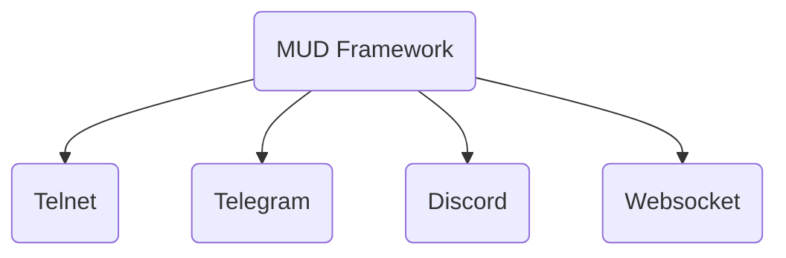

# Architecture

## Flexible Access

The framework will allow for multiple ways to access the server by connectors. While a strong focus will be on Telnet access to support existing MUD clients, other connectors will provide means to access the worlds as well.

The framework manages the world and its representation in a way that is independent from the medium it is accessed.