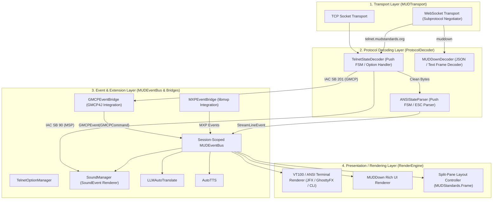
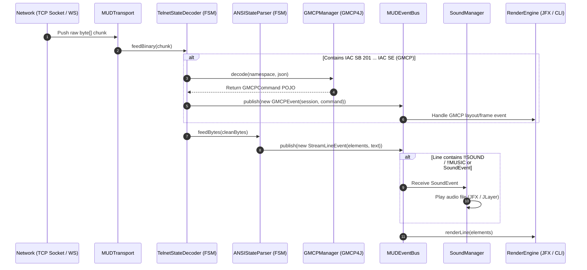

# RealmRunner Developer Architecture Guide

This document explains the architecture of the RealmRunner core system (`MUDClient-Base`), detailing how network data flows from raw socket/WebSocket frames through stateful push-decoders, session-scoped event buses, and presentation rendering engines.

---

## 1. High-Level Architectural Overview

RealmRunner uses a **4-Layer Push Pipeline Architecture** designed to support modern MUD standards (such as WebSockets, GMCP, MSP, MXP, and MUDDown) while maintaining full compatibility with traditional VT100/ANSI Telnet MUD servers.



---

## 2. Layer Deep Dive

### Layer 1: Transport Abstraction (`MUDTransport`)
Decouples raw byte retrieval from network protocols.
* **Push Callbacks**: `onBinaryFrame(byte[] data)`, `onTextFrame(String text)`, `onConnected(String subprotocol)`.
* **TCP Transport (`TCPTransport`)**: Reads network bytes into fixed chunks and pushes them directly downstream.
* **WebSocket Transport (`WebSocketTransport`)**: Inspects `session.getNegotiatedSubprotocol()` (`telnet.mudstandards.org`, `muddown`, `terminal.mudstandards.org`) during handshake and routes `@OnMessage` binary/text frames directly.

### Layer 2: Stateful Protocol Decoders (`ProtocolDecoder`)
Handles partial TCP packet boundaries and fragmented control sequences across data pushes using Finite State Machines (FSM).
* **`TelnetStateDecoder`**: Stateful FSM (`DATA`, `IAC`, `WILL`/`DO`, `SB`, `SUBNEG_DATA`). Buffers incomplete Telnet subnegotiations across chunk pushes until `IAC SE` arrives, parses GMCP via `GMCPManager.decode(...)`, publishes `GMCPEvent`s to `MUDEventBus`, and forwards clean display bytes.
* **`ANSIStateParser`**: Stateful FSM (`NORMAL`, `ESC_RECEIVED`, `CSI_RECEIVED`). Buffers fragmented CSI sequences (e.g. `\033[1;31m`) across chunk boundaries, emitting parsed `AParsedElement` lists (`SelectGraphicRendition`, `PrintableFragment`, `C0Fragment`).
* **`MUDDownDecoder`**: Decodes MUDDown JSON/Markdown text frames and publishes document events to `MUDEventBus`.

### Layer 3: Event & Extension Layer (`MUDEventBus` & Bridge Adapters)
Houses out-of-band protocols, media features, translation, and layout control.
* **`MUDEventBus`**: Thread-safe, session-scoped typed event bus (`subscribe(...)`, `publish(...)`).
* **Domain Events**:
  - `GMCPEvent`: Strictly carries strongly-typed `GMCPCommand` POJOs from `GMCP4J`.
  - `SoundEvent`: Contains sound attributes (`soundType`, `filename`, `volume`, `loops`, `priority`, `path`).
  - `FrameControlEvent`: Layout actions (`OPEN`, `CLOSE`, `UPDATE`, `STREAM`) per `MUDStandards.Frame`.
  - `StreamLineEvent`: Assembled ANSI elements and plain text lines.
* **Standalone Library Bridge Adapters**:
  - Standalone libraries (`TelnetLibrary`, `GMCP4J`, `libmxp`) remain 100% event-bus agnostic.
  - `GMCPEventBridge`: Implements `GMCPReceiver` $\rightarrow$ publishes `GMCPEvent` to `MUDEventBus`.
  - `MXPEventBridge`: Implements `MXPListener` $\rightarrow$ forwards MXP updates.
  - `TelnetOptionManager`: Configurable option coordinator allowing developers to enable, disable, or mock individual Telnet options (Echo, NAWS, TTYPE, GMCP, MSP, MXP) per session or test scenario.
  - `SoundManager`: Acts as a renderer for `SoundEvent` instances (`registerSession(MUDSession)`).

### Layer 4: Presentation & Rendering Layer (`RenderEngine`)
Abstracts visual display from network and protocol logic.
* **`AnsiTerminalRenderEngine`**: Adapts JavaFX (`libterminal-jfx`), GhosttyFX, JediTermFX, or VT100 CLI views.
* **`MUDDownRenderEngine`**: Renders Markdown documents, collapsible sections, and rich UI cards.
* **Split-Pane Layout Controller**: Subscribes to `FrameControlEvent` (`MUDStandards.Frame`) to dynamically manage split windows (map panel, inventory sidebar, combat log, main prompt).

---

## 3. End-to-End Data Flow (Sequence Diagram)

The sequence diagram below demonstrates how a raw TCP chunk containing a GMCP payload and text bytes flows through the system:



---

## 4. Developer Extension How-To

### How to Subscribe to GMCP Commands
To handle a specific GMCP command in your feature or UI controller:

```java
session.getEventBus().subscribe(GMCPEvent.class, event -> {
    if (event.getCommand() instanceof FrameOpen frameOpen) {
        System.out.println("Opening split frame: " + frameOpen.getId());
    } else if (event.getCommand() instanceof Hello hello) {
        System.out.println("Server Hello from: " + hello.getClient());
    }
});
```

### How to Trigger Sound Effects
To play a sound or music file, construct a `SoundEvent` and publish it onto the session's event bus:

```java
SoundEvent sound = new SoundEvent(session, SoundEvent.SoundType.SOUND, "doors/open.wav", soundFilePath);
sound.setVolume(80);
session.getEventBus().publish(sound);
```

### How to Test Telnet Options in Isolation
Use `TelnetOptionManager` to toggle specific options on or off for test sessions:

```java
TelnetOptionManager optionMgr = new TelnetOptionManager();
optionMgr.setMxpEnabled(false); // Disable MXP for test
optionMgr.setGmcpEnabled(true);  // Keep GMCP enabled

optionMgr.configureOptions(session, telnetProtocol, config, new String[]{"xterm-256color"});
```
