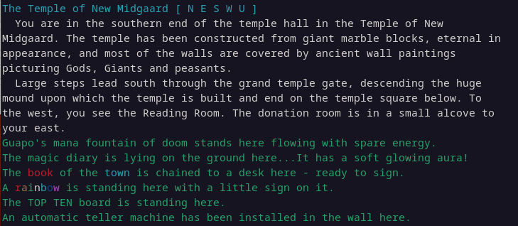

# Vision

This project aims to be a MUD codebase that

- supports MUD/Roguelike hybrids
- supports different kind of MUDs by configuration (e.g. by exchanging the combat module)
- is itself agnostic to the underlying RPG, but has several ways of interfacing with "your" RPG code
- is playable with any MUD client

## MUD/Roguelike hybrid - What is that?

MUDs (MUSHes, MOOs, ...) are traditionally text centric, where the textual description creates mental images, eventually enhanced with sound effects. Locations are described as "rooms" and you move your avatar from one room to another by text commands like "north". Depending on the MU* elements like PvE combat, PvP combat, roleplaying, exploring, grinding, questing are sometimes part of MU*s, sometimes not.

Roguelikes are prodecural generated environments, usually experienced as single player PvE experiences, where discovering, improving and survival are important aspects of the game. Visually they are tile-based, meaning a 2D grid map where each tile represents either a NPC/critter, an item or part of the surrounding.

There are already several MUDs that included roguelike elements, usually in form of a ASCII map for overland travels. Rarely has this been done for zones with rooms, because existing codebases simply haven't been built with gridbased maps in mind.

Having a visual representation of the world like in Roguelikes, but also text descriptions for places, is a key feature this codebase wants to support. You can read more about **how** this is done here.

## Configurable by nature

Serving two worlds with different requirements raises a lot of questions and preferences about how elements of the game are presented. E.g. should combat be textual or graphical? An automatic combat or turn-based? Is it something players should be able to configure or dictated for everyone?

This project aims to have different options for combat and give as much decision to players as possible.

## Adaptable to any RPG

We try to separate technical implementations from RPG rules wherever possible. There will be several places where the codebase needs to interface with actual RPG rules, to roll tests, calculate effects and other stuff and our goal is to concentrate this to dedicated places in the code. Spoken in Java: You will need to implement specific interfaces and implement some RPG-specific commands, but you won't need to dig through the codebase to find those places.

Some very high-level concepts - e.g. the existence of attributes, skills, an inventory - are modeled using a generic library to reflect RPGs that was already used in character generation software for Shadowrun, Coriolis, Ubiquity-based Space 1889 and Splittermond. You will likely need to use that high-level library, but this may change when this project gets more traction.